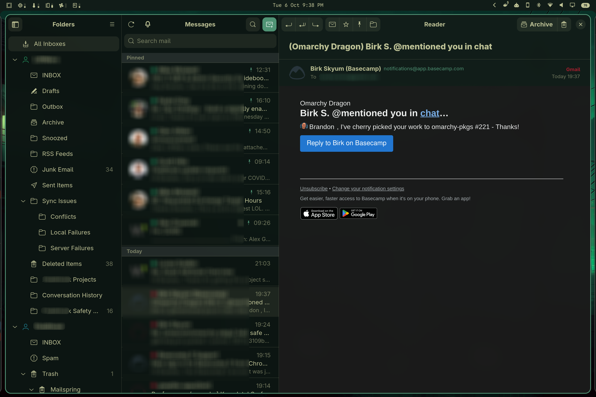

# Rustle

A fast, native email client for the Linux desktop, built with GTK 4 and libadwaita and
written in Rust.



Rustle sets out to be a mail app that looks at home on GNOME and on
[Omarchy](https://omarchy.org/). It has three panes (folders, messages, reader), one
inbox for all your accounts, and very little to set up.

## Features

**Accounts**
- Uses the accounts your desktop already has. Rustle reads them from Evolution Data
  Server, so anything you've added in GNOME Online Accounts (Google, Microsoft and so
  on), Evolution or graphmail-bridge just shows up.
- Sign in with OAuth through Online Accounts, so Rustle never sees your password.
- Or set an account up by hand with any IMAP/SMTP server (TLS or STARTTLS). iCloud
  works too, and its calendars and contacts come along.
- Give each account its own colour, label, signature and notification sound.

**Reading**
- A unified "All Inboxes" view, plus each account's full folder tree.
- Fast full-text search across all your mail.
- Pin important emails to the top of the list. Pins stay in sync with Outlook through
  graphmail-bridge.
- Star, mark read/unread, archive, delete, or move to any folder, with Undo.
- A "show unread only" filter.
- Sender avatars from Gravatar or the sender's website (off by default).
- Remote images stay blocked until you ask for them.
- Emails are displayed safely: no JavaScript, and nothing loads from the internet
  unless you allow it.

**Writing**
- A rich-text composer with bold, italic, lists, links, colours and attachments.
- Spell checking as you type.
- Reply, Reply All and Forward. Rustle also handles `mailto:` links.
- An Outbox that retries anything that didn't send.
- One-click unsubscribe.

**Staying up to date**
- New mail arrives instantly over IMAP IDLE, and Rustle also checks on a timer you
  pick.
- Desktop notifications with a sound of your choice.
- Optionally keeps running in the background and starts when you log in.
- Downloads your whole mailbox in the background, so search and scrolling cover
  everything.

**Looks**
- Follows your system accent colour and light/dark style.
- On Omarchy it follows the desktop theme live and changes along with every
  `omarchy theme set`.
- Keyboard shortcuts for everything (press <kbd>Ctrl</kbd>+<kbd>?</kbd> to see them).
- An optional phone layout for mobile shells such as omarchy-mobile.

## Dependencies

To build:

- Rust and `cargo`
- GTK 4 (4.18 or newer)
- libadwaita (1.8 or newer)
- WebKitGTK 6.0
- `blueprint-compiler`
- glib2 (for `glib-compile-schemas`)
- OpenSSL
- `pkg-config`

To run:

- Evolution Data Server (`evolution-data-server`), where your accounts live
- A Secret Service keyring, such as GNOME Keyring
- A spelling dictionary for your language if you want spell checking, e.g.
  `hunspell-en_us`
- GNOME Online Accounts, if you want to sign in with Google, Microsoft and so on (GNOME
  Settings or `gnome-online-accounts-gtk`)

On Arch / Omarchy:

```sh
sudo pacman -S --needed rust gtk4 libadwaita webkitgtk-6.0 blueprint-compiler glib2 \
  openssl pkgconf evolution-data-server gnome-keyring hunspell-en_us
```

On Debian / Ubuntu:

```sh
sudo apt install cargo libgtk-4-dev libadwaita-1-dev libwebkitgtk-6.0-dev \
  blueprint-compiler libglib2.0-dev-bin libssl-dev pkg-config evolution-data-server \
  gnome-keyring hunspell-en-us
```

On Fedora:

```sh
sudo dnf install cargo gtk4-devel libadwaita-devel webkitgtk6.0-devel blueprint-compiler \
  glib2-devel openssl-devel pkgconf-pkg-config evolution-data-server gnome-keyring \
  hunspell-en-US
```

## Install

```sh
git clone https://github.com/turbineBMW/Rustle.git
cd Rustle
sh install.sh
```

This builds a release binary and installs Rustle to `~/.local`, along with its icon,
desktop entry and settings, so it shows up in your app launcher. If a build dependency
is missing, the script tells you which one and how to install it.

To install for every user on the machine instead:

```sh
sudo PREFIX=/usr sh install.sh
```

Just want to try it out? Run it straight from the checkout, no install needed:

```sh
cargo run -p rustle
```

## Adding an account

Open the menu and choose **Manage Accounts**. From there you can:

- **Online Accounts**: sign in through your desktop with Google, Microsoft and others.
- **Manual Setup**: enter your address, password and server details yourself. For
  iCloud, use an app-specific password.

Accounts you add by hand are saved to Evolution Data Server, so Evolution and other apps
can use them too. If you remove an account that Rustle created, it is deleted. If you
remove one that came from somewhere else, Rustle just hides it.

## Omarchy themes

On Omarchy, **Preferences → Follow Omarchy Theme** (on by default) gives Rustle the
colours, accent and light/dark style of your current theme and keeps them in step as
you switch themes. Rustle reads the palette from
`~/.local/state/omarchy/current/theme/colors.toml`.

A theme can take full control by shipping its own `rustle.css` (plain GTK CSS setting
libadwaita's colour variables). Put it in the theme's directory, or generate it from a
`~/.config/omarchy/themed/rustle.css.tpl` template.

Turn the option off and Rustle goes back to your system accent and style.

## For developers

```sh
just run      # build and run from the checkout
just check    # clippy, rustfmt and the tests
```

Set `RUSTLE_LOG=debug` for verbose logging. Mail is stored in
`$XDG_DATA_HOME/rustle/rustle.db`. To try things without touching your real mail, point
`XDG_DATA_HOME` at a scratch directory.
